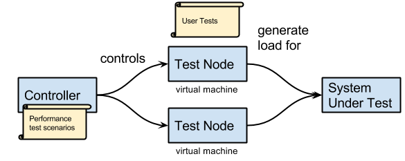

# bddloadgen

## Project Status

Under active development.

## What the Load Generator Is For
There are two uses:

1. Performance testing.
2. Distributing functional tests across multiple test nodes (test machines or VMs)
in order to execute them more rapidly.

## What Are the Distinguishing Features?
Refer to the figure below.



1. Performance test scenarios are defined in [Gherkin](https://github.com/cucumber/cucumber/wiki/Gherkin).
As such, performance test
scenarios are fully scriptable. There is no “user interface”. A performance test
scenario is executed by invoking it under [JBehave](http://jbehave.org/).
2. The performance test scenario specifies how many Test Nodes (VMs) are needed
and those are created and provisioned automatically.
3. The actual tests that get run against the system under test are labeled
“User Tests” in the figure. The User Tests are also implemented with JBehave.
The scripts/code for these tests is moved to each Test Node when the Node is
provisioned (automatically). Each time a user test is executed it is run under
a separate Java class loader, for full isolation.


## Usage Procedure
1. Install the loadgen-java.jar in an HTTP repository.
2. Identify the JBehave tests (.feature files and step classes) that you wish to run, to generate load.
3. Create a performance “control” (.feature) file, written in Gherkin.
4. Implement the control file, in Java.
5. Run the control file, using JBehave.
6. Retrieve results

Each of these steps is explained below.

## Install LoadGenerator


## Identify JBehave tests


## Instrument the tests

### Add `timelogBeginTest` and `timelogEndTest` to each test
The TestRunner needs to know when a test has actually begun. It cannot know this
on its own, because tests are invoked by JBehave, and invoking a test actually
takes a significant amount of time; so in order to be as accurate as possible,
we must call a method at the beginning of each test, to notify the TestRunner
that a test has begun. This method is the timelogBeginTest method, in the utility
class `loadgen.TestRunnerUtil`:

```
@Given ("^that we have a headless browser available$")
public void do_given()
{
    TestRunnerUtil.timelogBeginTest();  // beginning of test
    ...
}
```

Similarly, we must notify the TestRunner when a test has completed. This is
done with the `timelogEndTest` method.

```
@Then ("^a successful response is returned$")
public void do_then()
{
    ...
    TestRunnerUtil.timelogEndTest();  // end of test
}
```

If `timelogEndTest` is never called due to some kind of exceptional condition,
the TestRunner will merely use the time at which the invocation of JBehave ends
for that test.

### Define timers, if desired
The TestRunner can not only record the time to perform a test: it can record more
granular time intervals that you define. For example, suppose you want to record
the times that tests take to perform a certain section of code. To do this, you
can define a timer called, say, “MyTimer”, and add timer begin and end calls like this:

```
@When ("^a headless client requests$")
public void do_when()
{
    ...
    TestRunnerUtil.timelogBegin("MyTimer");
    ...
    TestRunnerUtil.timelogEnd("MyTimer");
    ...
}
```

In this case, the TestRunner will record the time between these calls, for each test, and LoadGenerator will compute statistics for these times.

To add these times to the graph produced by the LoadGenerator, simply add a line as follows to the test scenario step (Java file),

```
myPerformanceRun.graphEvent("MyTimer");
```

This will cause the time interval between `timeLogBegin("MyTimer")` and
`timeLogEnd("MyTimer")` to be recorded as a data item, for each test, and these
data items will be graphed over time. (See the Javadocs for
`loadgen.controller.PerformanceRun.graphEvent`)

## Create performance .feature file

## Implement performance “control” file


### Define a performance test run

```
LoadGenerator.performanceRun("spike", (perfRun) -> {
perfRun.setFeaturesDirectory(
perfRun.setStepsJarPath(
perfRun.stepClass(
perfRun.useProfile(
});
```

## Implement control file

## Run control file

## Retrieve results

# Test Node File System Artifacts

## JAR file structure

```
/loadgen
    /controller
           /templates
/testrunner
    TestRunner.class
/demo
```

## File structure on each Test Node

```
/var
    /Project
        /features/*.feature
        steps.jar     (a JAR that contains the step classes)
        <profiles>
    /Standard
        testrunner.sh
        jbehave.jar
        loadgen.jar (contains package “testrunner”)
```
# Ramp Function Algorithm

(TestRunner.java uses this algorithm.)

A ramp function is a linear increase or decrease of request rate over time.
The test nodes of BDDLoadgen generate load requests according to a statistical
distribution, which is determined by the ramp functions that are defined by the user.
In order to generate requests according to the correct
statistical distribution, it is therefore necessary to compute the statistical
distribution function. This is a little bit complex, because the event rate—being
a ramp function—is not constant, which means that we must
calculate a probability distribution for a non-constant event rate.

In addition, the user can specify a set of ramp functions which are joined together,
forming a composite function that is continuous but that has instantaneous changes
in slope. For example, the user might specify that the request rate should start
at zero, and gradually increase to 100 requests/sec over a period of two minutes,
then remain constant, and then incease rapidly to 300 requests/sec over ten seconds,
remain there for 60 seconds, and then drop back down to 100/sec over 60 seconds,
and then remain constant at 100/sec for the remainder of the test. This means that
when BDDLoadgen decides when the next event will be,
it must take into account these slope discontinuities.

## Ramp function

For a single unbounded ramp function, the request rate r as a function of time t is 
herefore given by,

<blockquote>
r = a t + c
</blockquote>

where a is a constant, t is the time, and c is a constant.

We need to consider bounded ramp functions that begin at t=0 and end at a point in the future,
with r always positive.

## Inverse cumulative distribution function

Consider a random variable x.
An inverse cumulative distribution function (ICDF), aka
[quantile function](https://en.wikipedia.org/wiki/Quantile_function),
typically represented as F<sup>-1</sup>(p), where p is the probability,
is the value of the variable x at which 100p% of the values of x are below
the value.
For example, if for a probability of .9 (i.e., 90%), F<sup>-1</sup> is, the value
of x is 3, it means that 90% of the values of values of x are 3 or less.

Given,

<dl>
<dd>a is the rate at which requests increase (i.e., the slope of the ramp function).</dd>

<dd>cp is the cumulative probability that a request will have occurred before time t:
the value of cp should be chosen using a random variable with uniform distribution
between 0 and 1.</dd>

<dd>c is the request rate at t=0.</dd>
</dl>

From the [Hazard Function](#hazard-function), if a ≠ 0,

<blockquote>
F<sup>-1</sup> = [ -c + √(c<sup>2</sup> - 2a ln(1-cp)) ] / a
</blockquote>

If a = 0,

<blockquote>
F<sup>-1</sup> = - [ ln(1-cp) ] / c
</blockquote>

If a < 0 then there is a range in which F is undefined: at any time t, if the
request rate is r (= a t + c), generate a random number for cp, between 0 and 1,
and compute:

<blockquote>
f<sub>0</sub> = 1 - exp(-a t<sup>2</sup>/2 - r t)
</blockquote>

If a < 0 and cp > f<sub>0</sub>, then the ICDF is imaginary: the predicted request then occurs
after where the ramp goes to zero, so exit the ramp. Otherwise, the time to the next
request is F<sup>-1</sup>(a, c, cp).

# Hazard Function

(The ramp function algorithm uses this.)

The request rate r = a t + c, where a is a constant, t is the time (t ≥ 0), and
c is a constant (c ≥ 0).

The cumulative distribution function F is given by

<blockquote>
(see <a href="http://data.princeton.edu/wws509/notes/c7.pdf">
http://data.princeton.edu/wws509/notes/c7.pdf</a>

1 - F(t) = exp[-∫<sub>0</sub><sup>t</sup>(a x + c)dx]

s.t. a t + c ≥ 0, a ≠ 0. If a < 0, then F is undefined in <1-exp(-a t<sup>2</sup>/2 - c t), 1>
</blockquote>

Thus,

<blockquote>
ln(1 - F(t)) = ∫<sub>0</sub><sup>t</sup>(a x + c)dx = - a t<sup>2</sup>/2 - c t
</blockquote>

We want to be able to solve for t, given a value of F (which we will pick using
a random number generator). We can rearrange this as,

<blockquote>
a t<sup>2</sup>/2 + c t + ln(1 - F) = 0
</blockquote>

If a ≠ 0, this is a quadratic equation, so we can solve for t:

<blockquote>
t = [-c + √(c<sup>2</sup> - 2a ln(1-F))] / a
</blockquote>

(We are only interested in positive solutions)

By the [probability integral transform theorem](https://en.wikipedia.org/wiki/Probability_integral_transform),
we can then write a generator for the distribution of <b>request times</b>,

<blockquote>
F<sup>-1</sup> = [-c + √(c<sup>2</sup> - 2a ln(1-cp))] / a
</blockquote>

where cp is a random number between (0, 1).

